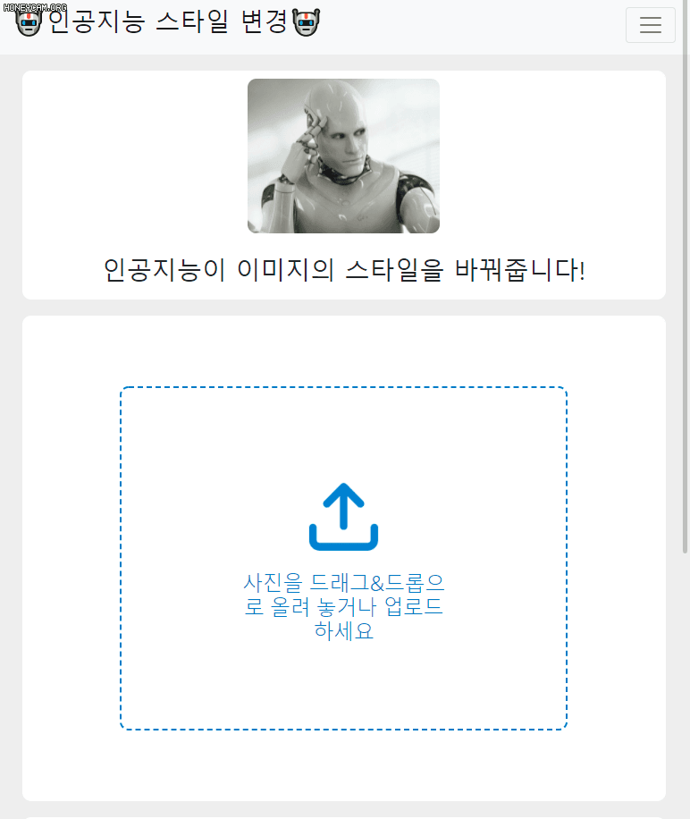
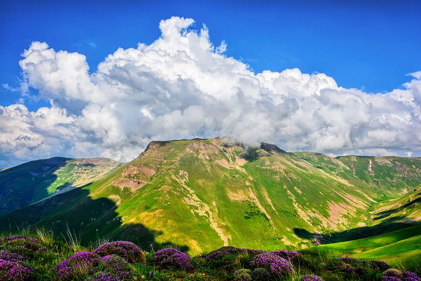
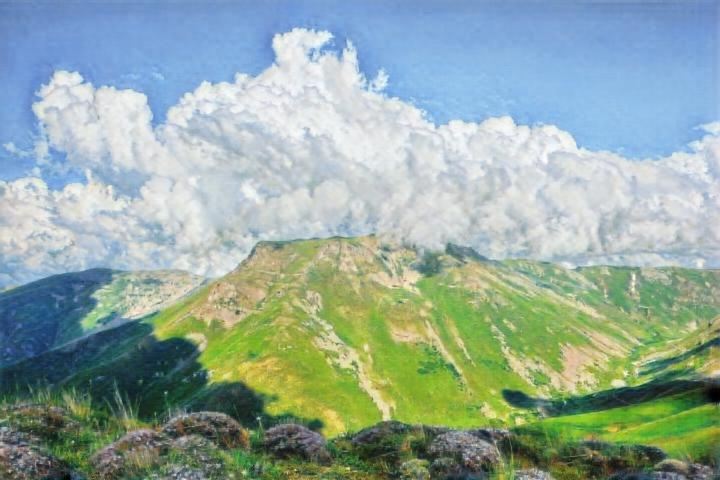

# CycleGAN Style Changer

Flask web app that uses Cycle GAN to change the style of image.  
This Network was trained on [monet2photo](https://www.kaggle.com/balraj98/monet2photo) dataset.  
If you train the network with another dataset, it's functionality will be changed according to the dataset.

Video: https://youtu.be/dbgwi2hdn34  

This project was done on 2020/10/10  

## Prerequisite
- You must download and restore the checkpoint data before you excute the program.  
- 100 epochs checkpoint data: https://drive.google.com/file/d/1-FVhF9t-o1E0fBioOUS3A1blZiSxtRkT/view?usp=sharing

## Preview

|Before (photo)|After (monet painting)|
|------|---|
|||
